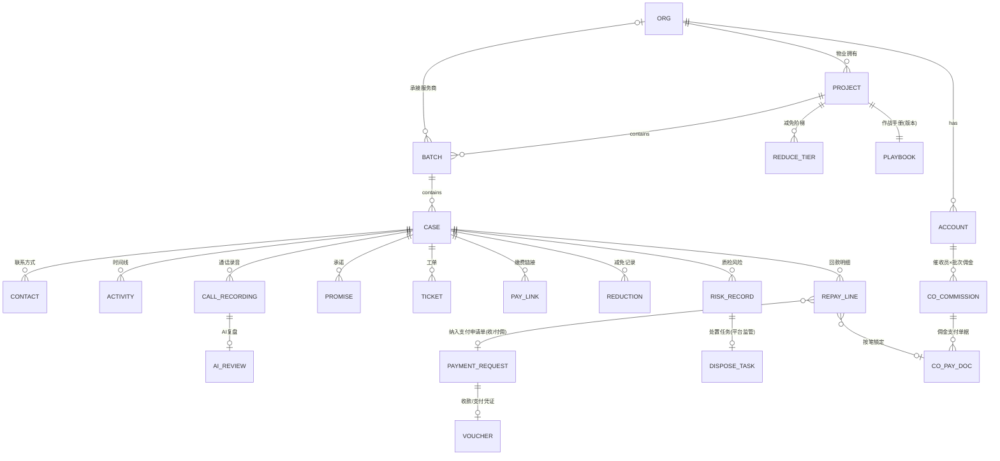

# 有证慧催 · 核心闭环 ERD（数据模型 v1.0.0·已冻结）

> 来源：高保真原型 mock 数据 + PRD（BR/US）+ `docs/ui/14-PRD-UI拉通评估报告.md` 口径。
> 与 `openapi-core.yaml` 配套（契约为 SSOT）：本文件定义实体/字段/关系/枚举字典；OpenAPI 的 schema 由此派生。当前与 openapi-core.yaml **v1.0.0（已冻结）** 对齐。
> 全模块已覆盖（存证 M6、计费/充值 M9-B、报表 M10、AI 配置 M5、组织成员 M1）。
> ⚠ 口径纠偏：原型里金额是字符串"¥1,200"——**ERD/契约一律用 `decimal` + 分(或元)单位 + 币种**；状态一律用枚举码（非中文展示串）。

## 0. 设计约定
- 主键统一 `id`（雪花/UUID，契约里为 `string`）；时间统一 `timestamptz`（ISO8601）。
- 金额统一 `amount_cents`（bigint，分）避免浮点；展示层格式化。比率 `rate`（numeric，**分数 0-1，如 0.30=30%**，v1.0.3 统一；DB 实存分数，展示层 ×100）。
- 多租户隔离三维：`org_id`（归属组织）+ 数据范围（SE 的 area/property/provider）；**所有查询强制按当前主体 scope 过滤**（见 BR-M1-05/14）。
- 软删除 + 审计：`created_at/updated_at/created_by`；关键动作写 `audit_log`。

## 1. 实体关系图（Mermaid）



## 2. 核心实体（字段摘要）

### ORG 组织
`id, type(OrgType), name, owner_account_id, status, credit_code?, legal?, phone?, addr?`

### ACCOUNT 账号（一号多账号：phone 可关联多 account）
`id, org_id, username(稳定唯一登录标识), name, phone, role_template(RoleTemplate), status, is_owner, data_range?(SE: {areas[],properties[],providers[]})`

### PROJECT 项目/小区（物业拥有）
`id, org_id, name, org_name, area, province, city, district, prop_company, credit_code?, legal?, addr?, contract_type, fee_rows[{biz,std}], fee_cycle, penalty, pay_info, comm_in_rate(收佣比例%·必填 BR-M9-01a), status`

### REDUCE_TIER 减免阶梯（项目级，批次可覆盖 BR-M2-18a）
`id, project_id, batch_id?(空=继承项目), discount, cap_cents?, waive_penalty(bool), decide(ReduceDecide)`

### BATCH 批次
`id, project_id, code(批次号，原 no 改 code 避 YAML1.1 布尔陷阱·与契约 BatchBase.code 对齐), provider_id?(承接服务商), comm_in_rate(生效收佣比例%·批次覆盖否则继承项目), comm_in_inherited(bool), pay_out_rate(付佣比例%·≤收佣 BR-M9-14), status, import_meta?, reduce_mode(ReduceMode INHERIT/CUSTOM, BR-M2-18b), playbook_mode(PlaybookMode INHERIT/CUSTOM, BR-M2-18b)`
> 回显**生效收佣/付佣比率**（D5 决策），佣金计算"基数×生效比率"有据。

### CASE 案件
`id, batch_id, project_id, project_name, owner_name, room, due_cents(应收), reduce_after_cents(减免后应收), status(CaseStatus), legal_stage(LegalStage·平行字段·与status正交), holder_id?(持有催收员), t_collector_deadline?, t2_deadline?, litigation_fields?(诉讼要素), closed_kind?(CloseKind), closed_at?`
> legal_stage 与 status **正交**（边催边诉）；看板"在诉"/报表"在诉数"按 legal_stage≠NONE 过滤，**不进主状态机**（D2 决策）。
> 脱敏：结案后对非平台/非物业角色，owner_name/contact/明细收敛（BR-M8-09）。

### CONTACT 联系方式
`id, case_id, phone, is_primary, invalid(bool)`

### ACTIVITY 时间线（统一活动流）
`id, case_id, type(ActivityType), actor_id, content, ref_id?, created_at`

### CALL_RECORDING 通话录音（App本机通话结束自动检测上传/手动上传 BR-M4-01b）
`id, case_id, collector_id, source(APP_AUTO自动上传/MANUAL手动上传), status(CallRecStatus), recorded_at?, duration_sec?, phone?, transcript?`
> "获取最新通话录音"=查最近一通的录音/解析状态(有无录音上来+解析进度)，**客户端读本机目录非服务端接口**；无文件→引导手动上传。

### AI_REVIEW AI复盘（解析后 BR-M5-04a）
`id, call_id, summary, dialogue[{speaker,text}], risks[{level,desc,segment_ts}], suggestions[], result_mark(MarkCode)`

### PROMISE 承诺 / TICKET 工单 / PAY_LINK 缴费链接
- PROMISE `id, case_id, date, amount_cents, state`
- TICKET `id, case_id, type, from_role, to_role, status(TicketStatus), receipt?`
- PAY_LINK `id, case_id, token, amount_cents, expires_at, status(PayLinkStatus)`（业主 H5 凭 token 只读 BR-M7-01）

### REDUCTION 减免记录
`id, case_id, tier_ref, discount, amount_cents, decide(ReduceDecide), state(ReduceState), applied_by, note`
> 催收员自决档→state=EFFECTIVE 直接生效；超自决档→state=OFFLINE_TRACE（系统仅留痕、线下处理，**不进系统审批** BR-M2-18a）；PL 可系统内核准。

### REPAY_LINE 回款明细（结算单元 BR-M9-12a）
`id, case_id, batch_id, amount_cents, channel(Channel), paid_at, marked_by(协调员标注 US-M4-08), settled(bool), payment_request_id?(纳入哪张支付申请单)`
> 取消 dispute_id（案件级在线异议作废 BR-M9-12c）。

### PAYMENT_REQUEST 支付申请单（按案件明细手动组单 BR-M9-12a/b/d）
`id, side(ReconSide IN收佣/OUT付佣), batch_id, generated_by(收佣=平台/付佣=服务商), line_ids[], base_cents, comm_cents, status(PaymentRequestStatus PENDING/PAID/VOIDED), completed_by?, completed_at?, voided_at?, void_reason?`
> **收款方生成、付款方付款、生成方完成前可撤**（双线对称）：
> - 收佣线：平台生成→物业线下付款→**平台确认收款**=PAID；平台确认前**撤销**→VOIDED、明细释放。物业只查看。
> - 付佣线：服务商生成→平台付款→**平台上传支付凭证**=PAID；平台支付前服务商**撤回**→VOIDED。
> **取代**对账单确认/驳回/申诉 + 案件级在线异议——纠错=撤销/撤回→改明细→重生成。

### VOUCHER 凭证（收款/支付）
`id, payment_request_id, type(收款凭证/支付凭证), file_url, uploaded_by, uploaded_at`

### CO_COMMISSION 催收员佣金（服务商内部·人×批次 BR-M9-19）
`id, collector_id, batch_id, rate(%·≤付佣比例防倒挂 US-M9-02)`
> 应得/已结/未结由 REPAY_LINE×rate 汇总（非存储）。

### CO_PAY_DOC 佣金支付单据（人→批次→明细→生成支付单→确认支付=结算 BR-M9-19）
`id, collector_id, line_ids[], count, amount_cents, status(CoPayDocStatus), tm`

### RISK_RECORD 质检风险（全量检测 BR-M5-07）
`id, case_id, call_id, collector_id, provider_id, property_id, type(可配 CFG-RISK-TYPES), level(RiskLevel), segment_ts, reviewed(RiskReviewVerdict?), reviewed_by?`

### DISPOSE_TASK 风险处置任务（**仅平台监管视图** BR-M5-07b）
`id, risk_id, provider, task_type(整改/培训), status(DisposeTaskStatus), tm`
> 实质处置归所属组织负责人（BR-M5-07a）：催收员→VL，物业协调员→PL；平台只复核（BR-M5-07c）。

### PLAYBOOK 作战手册 / SCRIPT_LIB 话术库（平台护城河）
- PLAYBOOK `id, project_id, version, content, status, adopt_mode(PlaybookAdoptMode), adopted_by`（采纳人=PL或PC BR-M5-05a；分级采纳闸 BR-M5-05b）
- SCRIPT_LIB `id, scene, intent, cohort, source(ScriptSource), uses, promise_rate, repay_rate, wilson?, status(ScriptStatus), variant?{text,uplift,state}`（**仅平台可见可管** BR-M5-06/06a；自我迭代变体晋升 BR-M5-12a）

### BILLING_USAGE 能力用量（**只用量不金额** US-M10-02）
`id, org_id, type(BillingType), qty, unit, case_id?, occurred_at`

---

## 3. 枚举字典（契约 enum 单一事实源 · 中文为展示名）

| 枚举 | 值（码 = 展示名） |
|---|---|
| **OrgType** | PLATFORM=平台 ｜ PROPERTY=物业 ｜ PROVIDER=服务商 |
| **RoleTemplate** | SA=平台超管 ｜ SE=平台员工 ｜ PL=物业负责人 ｜ PC=物业协调员 ｜ VL=服务商负责人 ｜ CO=催收员 |
| **CaseStatus** | PENDING_DISPATCH=待派单 ｜ PROVIDER_SEA=服务商公海 ｜ IN_PROGRESS=进行中 ｜ PROMISED=承诺缴费 ｜ SETTLED=已结清 ｜ WITHDRAWN=已撤案 ｜ BAD_DEBT=坏账 ｜ VOIDED=已作废(仅待派单可作废·误传纠错 BR-M2-17) |
| **CloseKind**（手动结案，结清属 CaseStatus.SETTLED 非此枚举） | WITHDRAWN=撤案 ｜ BAD_DEBT=坏账 |
| **ActivityType** | CALL=通话 ｜ NOTE=跟进 ｜ TICKET=工单 ｜ SMS=短信 ｜ EVIDENCE=存证 ｜ PROMISE=承诺 ｜ LEGAL=法务 ｜ STATUS=状态变更 ｜ OPLOG=操作日志 |
| **CallRecStatus** | NO_FILE=无录音(需手动上传) ｜ UPLOADING=上传中 ｜ PARSING=解析中 ｜ READY=已就绪 ｜ FAILED=解析失败(可重试 BR-M5-08) ｜ QUOTA_BLOCKED=分钟余额不足暂停解析(充值后可补解析 BR-M5-02/BR-M4-02a) |
| **LegalStage**(平行字段) | NONE=无 ｜ FUNCTION_LETTER=催收函 ｜ LAWYER_LETTER=律师函 ｜ LITIGATION=起诉 ｜ DELIVERED=已送达 |
| **MarkCode** | 取值来自 CFG-MARK-CODES（平台可配）；常见值 PROMISED=承诺缴费 ｜ REFUSED=拒绝缴费 ｜ NEED_TICKET=需建工单 ｜ FOLLOW_UP=再次跟进 ｜ NO_ANSWER=无人接听（前四=接通有效，末=未接通）。不再硬编码为固定枚举。**v1.0 结构变更**：Settings.markCodes/SettingsInput.markCodes 每项从 `{code,label,enabled}` 扩展为 `{code,label,enabled,connected,effectiveFollowUp}`；effectiveFollowUp=true 时服务端重置 T_collector（BR-M4-03/12） |
| **ReduceDecide** | COLLECTOR_SELF=催收员自决 ｜ OFFLINE_INTERNAL=线下内部流程 ｜ PL_APPROVE=物业负责人核准 |
| **ReduceState** | EFFECTIVE=生效 ｜ OFFLINE_TRACE=线下留痕（系统不审批） |
| **DispatchMode** | WHOLE=整批派给 ｜ SPLIT=拆单派 |
| **Channel** | WECHAT_QR=微信收款码 ｜ BANK_TRANSFER=对公转账 ｜ CASH=现金 |
| **ReconSide** | IN=收佣（平台↔物业·平台生成） ｜ OUT=付佣（平台↔服务商·服务商生成） |
| **PaymentRequestStatus** | PENDING=待付(可撤销/撤回) ｜ PAID=已完成(凭证·锁定) ｜ VOIDED=已作废(撤销/撤回·明细释放) |
| **PromiseState** | PENDING=待履约 ｜ FULFILLED=已兑现 ｜ PARTIAL_FULFILLED=部分兑现(分期 BR-M4-13) ｜ BROKEN=已爽约 |
| **Pool** | PLATFORM_SEA=平台公海 ｜ PROVIDER_SEA=服务商公海 ｜ OPEN_POOL=开放抢单池 ｜ PRIVATE=私海(持有催收员) |
| **LegalDocType** | COLLECTION_LETTER=催收函 ｜ LAWYER_LETTER=律师函 ｜ LITIGATION=起诉状(BR-M4-18) |
| **LegalDocStatus** | GENERATING=生成中 ｜ GENERATED=已生成PDF ｜ DELIVERED=已送达 ｜ SIGNED=已签收 ｜ ARCHIVED=已存证 |
| **EvidenceScene** | DELIVERY=送达 ｜ RECORDING=录音 ｜ MATERIAL_PACK=材料打包(同价按次 BR-M6) |
| **EvidenceStatus** | ISSUING=出证中 ｜ ISSUED=已出证 ｜ FAILED=失败 |
| **SettingsDomain** | TIMERS=计时器 ｜ ROTATION=轮转 ｜ MARK_CODES=标记码(CFG-MARK-CODES) ｜ CLOSE_REASONS=关闭原因 ｜ SMS=短信阈值 |
| **CoPayDocStatus** | PENDING_PAY=待支付 ｜ SETTLED=已结算（支付完成=结算完成） |
| **TicketStatus** | PENDING=待处理 ｜ HANDLED=已回执 |
| **PayLinkStatus** | ACTIVE=有效 ｜ EXPIRED=失效/作废 |
| **RiskLevel** | HIGH=高 ｜ MID=中 ｜ LOW=低（细分 L1/L2 提示级） |
| **RiskReviewVerdict** | CONFIRMED=确认风险 ｜ FALSE_POSITIVE=误报撤销 ｜ ESCALATED=升级平台处置 |
| **DisposeTaskStatus** | PENDING=待整改 ｜ DONE=已整改 |
| **ScriptSource**（外围·话术库，core 契约暂未暴露端点） | AI_MINED=AI提炼 ｜ EXPERT=专家录入 |
| **ScriptStatus**（外围·话术库） | EFFECTIVE=生效 ｜ CANDIDATE=候选 ｜ RETIRED=淘汰 |
| **PlaybookAdoptMode**（外围·作战手册） | FORCE_MANUAL=强制人工采纳 ｜ LOW_RISK_AUTO=低风险自动采纳（可回滚） |
| **BillingType** | STT=语音转写(分钟) ｜ SMS=短信(条) ｜ EVIDENCE=存证(次) ｜ LEGAL=法律服务(件) |
| **RechargeType** | STT=通话解析分钟(物业/服务商预充) ｜ SMS=短信条数(仅物业预充)。注：EVIDENCE/LEGAL 按次计入对账非预充(BR-M9-10) |
| **SupervisionAction** | REMIND=提醒 ｜ TALK=督导谈话 ｜ TRAINING=安排培训 ｜ NOTE=记录（BR-M10-10；组织负责人对本组织成员发起督导并留痕） |
| **SmsSendStatus** | SENT=已发送 ｜ FAILED=发送失败 ｜ DELIVERED=已送达（依通道能力；失败不退条数，BR-M9-08） |

---

## 4. 状态机（关键·行为契约，契约测试需覆盖非法流转→409）

**案件 CaseStatus**
```
PENDING_DISPATCH → PROVIDER_SEA → IN_PROGRESS ⇄ PROMISED
   IN_PROGRESS/PROMISED → SETTLED(累计实收=减免后应收, 自动)
   IN_PROGRESS/PROMISED → WITHDRAWN | BAD_DEBT(填原因留痕·不设审核流 BR-M2-17/M8)
   PROVIDER_SEA → (T2超时) 退回平台公海/重分配
   PENDING_DISPATCH → VOIDED(误传纠错·仅待派单可作废·填原因留痕 BR-M2-17；批次/案件 void 端点；409 非此态)
```
**支付申请单 PaymentRequestStatus**：`(收款方勾明细生成) PENDING →(对方付款+收款方确认/凭证) PAID 锁定+明细已结算` ｜ `PENDING →(生成方撤销/撤回) VOIDED + 明细释放→可重组`。收佣线生成方=平台、完成=平台确认收款；付佣线生成方=服务商、完成=平台支付+凭证。PAID 后不可撤。
**通话录音 CallRecStatus**：`(App通话结束自动检测) 有文件→UPLOADING→PARSING→READY(直达AI复盘) | FAILED(可重试)` ｜ `无文件→NO_FILE(引导手动上传)→UPLOADING…`
**佣金支付 CoPayDocStatus**：`(勾选未结明细生成) PENDING_PAY →(确认支付) SETTLED + 锁定 line.settled`
**话术变体（自我迭代 BR-M5-12a）**：`(AI产变体) A/B → AI提炼=达标自动晋升 | 专家=人工复核 → 晋升(保留旧版可回滚) | 驳回`

> 口径锚点（2026-06-24 更新为支付申请单模型）：金额不含税基数(BR-M9-01b)；**结算=按案件明细手动组支付申请单、收款方生成、撤销/撤回重生成、取消在线异议**(BR-M9-12a/b/c作废/d)；减免无系统审批(BR-M2-18a)；风险处置归属(BR-M5-07a)；平台只建平台员工(BR-M1-04a)；通话本机录音自动上传(BR-M4-01b)。

> x-data-scope 说明：`case-actor` = 案件持有催收员 OR 案件关联 PL/PC OR 平台代操作(SA)；仅持有催收员本人动作重置 T_collector（BR-M4-01a）
