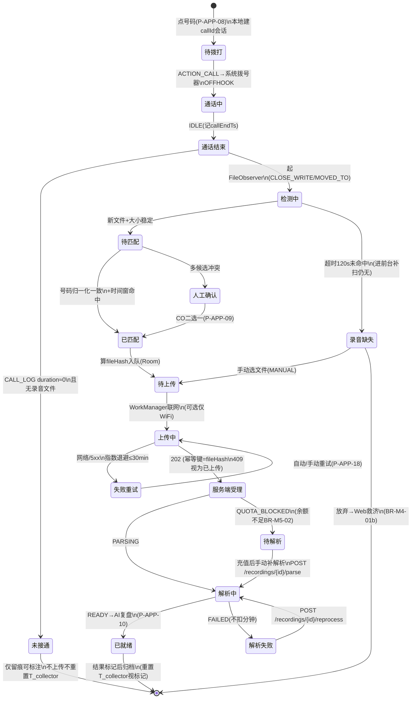
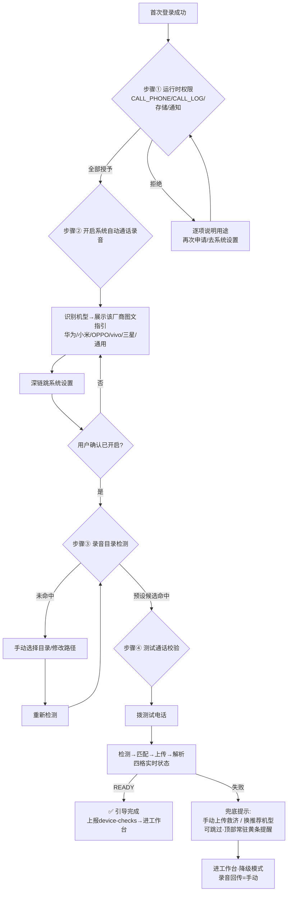

# 有证慧催 UI · 15 App 页面规划（催收员 Android App）

> 依赖：[../prd/11-移动App.md](../prd/11-移动App.md)（M11 产品规划，BR-APP-xx）、[00-设计总纲](./00-设计总纲.md)（ds-admin 设计系统）、[01-页面清单与信息架构](./01-页面清单与信息架构.md)（P-WORK-10 拨号页在此展开）、`docs/api/openapi-core.yaml`。
> 范围：CO 单角色作业 App（BR-APP-01）；页面编号沿用 `P-APP-xx`。所有端点均为契约既有（含 §7 增量提案项，标注 ⊕）。

---

## 1. 页面清单总览（18 屏）

| 编号 | 页面 | 类型 | 主端点 | 权限门控（auth.me.permissions） |
|---|---|---|---|---|
| P-APP-01 | 启动页（自检） | 全屏 | 本地自检 + ⊕`POST /device-checks` | — |
| P-APP-02 | 登录 | 表单 | `POST /auth/login`、`POST /auth/sms-code` | —（public） |
| P-APP-03 | 多账号选择 | 列表 | `POST /auth/select-account` | —（loginTicket） |
| P-APP-04 | 首登引导向导（4 步，分厂商） | 向导 | 本地 + ⊕`POST /device-checks` | 登录态 |
| P-APP-05 | 工作台（今日驾驶舱） | 看板 | `GET /workbench` | 登录态（CO layout=cockpit） |
| P-APP-06 | 案件列表（持有/公海 Tab） | 列表 | `GET /cases`、`GET /sea`、`GET /search` | 公海Tab: `case.claim` |
| P-APP-07 | 案件详情（作业台） | 详情 | `GET /cases/{id}` | 数据范围 case-actor |
| P-APP-08 | 拨号确认浮层 | 浮层 | 本地（号码取自案件详情） | `case.call` |
| P-APP-09 | 通话结束回执（录音匹配确认） | 浮层/页 | `GET /cases/{id}/recordings/latest`、`POST /cases/{id}/recordings` | `case.call` |
| P-APP-10 | AI 复盘（含通话结果标记） | 详情 | `GET/POST /recordings/{id}/ai-review` | 标记: `case.follow` |
| P-APP-11 | 跟进表单 | 表单 | `POST /cases/{id}/follow-ups` | `case.follow` |
| P-APP-12 | 承诺表单（单笔/分期） | 表单 | `POST /cases/{id}/promises` | `case.promise` |
| P-APP-13 | 缴费链接（发送/跟踪） | 表单+列表 | `POST /cases/{id}/pay-links`、`GET /me/pay-links`、resend/void | `case.paylink` |
| P-APP-14 | 工单（创建/回执查看） | 表单+列表 | `POST/GET /cases/{id}/tickets` | `case.ticket` |
| P-APP-15 | 通话记录 | 列表 | `GET /recordings` | 数据范围 range |
| P-APP-16 | 消息中心 | 列表 | `GET /notifications`、unread-count、read | 登录态 |
| P-APP-17 | 我的（业绩/结算/设置） | 看板+表单 | `GET /me/stats`、`GET /me/settlement`、`PATCH /me` | `cocomm.self.view` |
| P-APP-18 | 上传队列管理 | 列表 | 本地 Room 队列 + `GET /recordings/{id}` | 登录态 |

---

## 2. 导航结构

**底部 Tab ×4**（一线作业高频优先）：

```
┌─────────────────────────────────────┐
│              内容区                   │
├─────────┬─────────┬────────┬────────┤
│ 工作台   │  案件    │  消息●  │  我的  │
│(P-APP-05)│(P-APP-06)│(P-APP-16)│(P-APP-17)│
└─────────┴─────────┴────────┴────────┘
```

- **工作台** = 默认落地页（今日驾驶舱，BR-M4-20a）；**案件** Tab 内二级分段：我的持有 / 公海抢单；**消息** 角标 = `GET /notifications/unread-count`；**我的**内收纳：业绩、结算、通话记录（P-APP-15）、上传队列（P-APP-18）、设置。
- 案件详情（P-APP-07）是全 App 的汇聚点：工作台待办、列表、消息、通话记录、搜索均可直达；作业动作（P-APP-08~14）全部以浮层/半屏弹出挂在详情之上，**办完回详情**，不深栈跳转。
- 顶部全局：搜索入口（`GET /search`，公海未持有命中脱敏 BR-M3-21a）。

---

## 3. 每屏规格

### P-APP-01 启动页（自检）
- 核心元素：logo、启动自检进度（权限/白名单/目录可读三项，静默 ≤1s 通过则直进）；自检未过 → 红条提示 + "去处理"直达 P-APP-04 对应步骤。
- 契约：本地自检；结果增量上报 ⊕`POST /device-checks`（BR-APP-08）。

### P-APP-02 登录
- 核心元素：账号密码 / 手机验证码两 Tab（BR-M1-10）；验证码 60s 倒计时（429 限流提示）；隐私政策勾选（首启弹全文，§4.3 合规）。
- 主操作：登录 → 单账号直接得 token；多账号返回 loginTicket → 跳 P-APP-03。
- 错误分支：401 凭据错 / 网络不可达 文案区分；非 CO 账号登入 → 提示"请使用网页端"（BR-APP-01）。
- 契约：`POST /auth/sms-code`、`POST /auth/login`、`GET /me`。

### P-APP-03 多账号选择
- 核心元素：该手机号绑定的账号卡列表（组织名+角色中文名+账号名，BR-M1-11/13）；非 CO 账号卡置灰标注"请在网页端使用"。
- 契约：`POST /auth/select-account`。

### P-APP-04 首登引导向导（分厂商，BR-M4-01c）
- 四步步进条：①权限申请（逐项卡片：图标+用途一句话+授予按钮）→ ②开启系统自动通话录音（自动识别机型，展示该厂商图文指引 + "去设置"深链）→ ③录音目录确认（预设候选探测结果 / 手动改路径 / 重新检测）→ ④测试通话校验（拨测试电话 → 实时展示 检测→匹配→上传→解析 四格状态 → READY 打绿勾）。
- 可跳过但顶部常驻黄条"录音自动回传未就绪"；任一步失败给兜底文案（手动上传救济/推荐机型）。
- 契约：本地为主；④走 `POST /cases/{id}/recordings` 测试链路（或专用测试模式）；结果上报 ⊕`POST /device-checks`。

### P-APP-05 工作台（今日驾驶舱，BR-M4-20a 移动化）
- 核心元素：顶部 KPI 行（今日待办/承诺到期/临近释放/新分配，点击即筛，`WorkbenchKpi.filterKey`）；待办卡片流（紧急度左侧色条 HIGH红/MED橙/LOW灰，`WorkbenchTodo`：类别标签+业主/房号+截止时间）；类别 = CO 四类 PROMISE_DUE / RELEASE_WARN / TICKET_RECEIPT / NEW_ASSIGNED。
- 主操作：点待办卡 → 直达案件详情并锚到对应区（承诺到期→承诺Tab）；下拉刷新。
- 与 PC 差异：master-detail 改为"列表→详情"两级；办完返回自动滚到下一条（流式办案精神保留）。
- 契约：`GET /workbench`（layout=cockpit）。

### P-APP-06 案件列表
- 二级分段 Tab：**我的持有**（`GET /cases`，含持有上限进度条 x/CFG-HOLDCAP）｜**公海抢单**（`GET /sea?pool=provider` 与 `pool=open` 二级筛选：本商公海/开放池）。
- 列表卡片：业主名/房号/项目/应收（`.num` 等宽）/状态胶囊/入池来源徽标（T1超时/T2退回/开放抢单，BR-M3-21）；**公海未持有卡片电话脱敏 138\*\*\*\*0001**（BR-M3-21a）。
- 主操作：持有卡→详情；公海卡→「抢单」按钮（`case.claim`，409 已被抢/超上限 toast 原因）；筛选（项目/批次/状态）+ 搜索。
- 契约：`GET /cases`、`GET /sea`、`POST /cases/{id}/claim`、`GET /search`。

### P-APP-07 案件详情（作业台，全 App 核心）
- 结构（PC 三栏 CRM 竖屏重排）：
  - **案件头**（吸顶）：业主/房号/项目·批次/应收（减免后）/状态/T_collector 剩余天数角标（临近释放红色）。
  - **主操作区**（头下方大按钮行，权限显隐）：`[拨打]`（主色大按钮，`case.call`）+ 次级：写跟进/登记承诺/发缴费链接/转工单/建议法务/释放（释放走二次确认+选原因，BR-M3-27）。
  - **Tab 区**：概览（欠费明细/同业主其他在催提示 BR-M4-21/协调员处理事项状态 BR-M4-24 催收员视角）｜时间线（跟进/通话/承诺/工单/法务混排，通话条内嵌播放器 ⊕`GET /recordings/{id}/audio` + 解析状态胶囊）｜承诺（分期履约状态 已兑现/部分/违约）｜通话前策略（作战手册：AI 动态策略在上、物业静态资料在下，BR-M5-04）。
- 联系电话列表：主号码置顶、标签胶囊（本人/亲属/朋友/其他）、无效号置灰；长按 → 设主号/标无效/编辑（`PATCH /contacts/{id}`，`case.follow`）。
- 契约：`GET /cases/{id}`（聚合一次取齐）、`GET /cases/{id}/promises`、`GET /cases/{id}/tickets`。

### P-APP-08 拨号确认浮层
- 半屏浮层：号码列表（主号默认选中）+ 通话前策略摘要卡（作战手册 AI 动态策略 top3，BR-M5-04）+ 大按钮「拨打」。
- 点拨打 → 本地建 callId 会话（BR-APP-03）→ `ACTION_CALL` 跳系统拨号器 → App 退后台。**无服务端调用**（BR-M4-01b：系统不主动拨号）。

### P-APP-09 通话结束回执（录音匹配确认）
- 触发：TelephonyCallback IDLE 后 App 自动弹出（在前台）或通知栏卡片（在后台）。
- 状态呈现（= 录音状态机可视化）：`检测录音中… → 已匹配(文件名/时长) → 上传中(进度) → 解析中 → 已就绪`；每态一行图标+文案。
- 分支：**未接通**（CALL_LOG duration≈0）→ 显示"未接通"，提供未接通类标注快捷入口（仅留痕不重置 T_collector，BR-M4-03）；**检测超时/无文件** → "未检测到录音"+「手动选择录音文件」（`source=MANUAL`）+「去检查录音设置」（回 P-APP-04③）；**匹配冲突**（多候选）→ 列出候选让 CO 二选一（BR-APP-05/§3.3 宁问不错挂）。
- 已就绪 → 主按钮「查看 AI 复盘」直达 P-APP-10（BR-M4-01b"获取最新通话录音"语义）。
- 契约：`POST /cases/{id}/recordings`（幂等键）、`GET /cases/{id}/recordings/latest`、`GET /recordings/{id}`（轮询）。

### P-APP-10 AI 复盘（BR-M5-04a 移动化）
- PC 右侧抽屉 → App 全屏页，三段：①**对话记录**（说话人分离气泡：催收员右·绿、业主左·白，`.chat` 令牌沿用；点气泡定位录音时间点回放）；②**质检风险点**（L1/L2 胶囊 + 定位片段）；③**下一步建议**（StrategyCard 卡片，「采纳」按钮联动对应动作浮层：PROMISE→P-APP-12、TICKET→P-APP-14、PAYLINK→P-APP-13、FOLLOWUP→P-APP-11，采纳传 `sourceSuggestionId` 留溯源）。
- 底部吸底：**通话结果标记**（CFG-MARK-CODES 枚举胶囊单选 + 小结输入，`POST /recordings/{id}/ai-review`，接通有效类重置 T_collector，BR-M4-03a）。
- 契约：`GET /recordings/{id}/ai-review`、`POST /recordings/{id}/ai-review`、⊕`GET /recordings/{id}/audio`。

### P-APP-11 跟进表单（半屏浮层）
- 元素：跟进方式段选（CALL/SMS/VISIT/WECHAT/OTHER）+ 内容多行 + 附件（拍照/相册/文件，压缩上传）。写入不改案件状态（BR-M4-03a）。
- 离线：提交失败入本地写队列，卡片标"待同步"（BR-APP-06）。
- 契约：`POST /cases/{id}/follow-ups`（FollowUpInput）。

### P-APP-12 承诺表单（半屏浮层）
- 元素：单笔/分期切换；单笔=金额+日期；分期=期数编辑器（每期金额+日期行，自动合计校验）；提交后生成待跟踪项、到期进工作台待办（BR-M4-13）。
- 契约：`POST /cases/{id}/promises`（PromiseInput.installments）。

### P-APP-13 缴费链接
- 发送浮层：金额只读（=减免后应收，BR-M4-04）+ 渠道选择 `短信`（扣物业条数，冷却期按钮置灰+倒计时，409 BIZ_SMS_COOLDOWN）/ `复制链接`（转微信，不限频不扣条，BR-M4-14a/15）；有效链接未过期时优先提示「重发」。
- 跟踪列表（我的Tab 内入口）：本人已发链接（业主/房号/金额/渠道/状态胶囊 有效/已过期/已作废），行操作 重发/作废。
- 契约：`POST /cases/{id}/pay-links`、`POST /pay-links/{id}/resend`、`POST /pay-links/{id}/void`、`GET /me/pay-links`。

### P-APP-14 工单
- 创建浮层：类型枚举（上门核实/材料证明/法务工单/其他，BR-M4-17）+ 诉求描述；案件详情 Tab 内看状态（待协调员处理/已处理+回执摘要，BR-M4-24 催收员视角）。
- 回执到达 → 消息中心 + 工作台 TICKET_RECEIPT + 时间线三处同步（BR-M4-23）。
- 契约：`POST /cases/{id}/tickets`、`GET /cases/{id}/tickets`、`GET /tickets?status=`。

### P-APP-15 通话记录（BR-M4-22）
- 列表：本人可见范围通话（业主/房号/时长/解析状态），搜索（姓名/房号/电话）+ 过滤（项目/批次/时间区间）；行点击 → AI 复盘或案件详情。
- 契约：`GET /recordings`。

### P-APP-16 消息中心
- 列表：通知卡（类别图标：工单回执/线下回款/律师函进展/新分配/系统），未读圆点；点卡 → 标已读 + 深链目标（案件/工单）。
- 契约：`GET /notifications`、`POST /notifications/{id}/read`、`GET /notifications/unread-count`（Tab 角标）。

### P-APP-17 我的
- 业绩卡：本月回款/结清/接通/承诺兑现（`GET /me/stats?month=`，服务商内部考核口径 BR-M9-19a）；结算卡：`GET /me/settlement`（只读）。
- 入口列表：通话记录（P-APP-15）/ 上传队列（P-APP-18）/ 录音设置（回 P-APP-04 各步单独入口）/ 上传网络策略（仅 WiFi 开关）/ 改密·换绑（`PATCH /me`）/ 隐私政策 / 检查更新（内置升级）/ 退出登录。

### P-APP-18 上传队列管理（BR-APP-07）
- 分组列表：上传中(进度)/待上传/失败(原因+重试按钮)/已完成(保留7天)；顶部汇总条"N 个待传，M 个失败"；全局失败时案件 Tab 角标提示。
- 操作：单条重试/删除、全部重试；点已完成条目 → 查解析状态（`GET /recordings/{id}`）。

---

## 4. 设计语言（ds-admin 同族移动端 token）

> 原则：**色彩/语义/字阶沿用 `assets/ds-admin.css` 的 CSS 变量，密度与触达尺寸改移动**。App 与 PC 是同一设计系统的两个密度档，不另起视觉炉灶。

| 项 | PC（ds-admin） | App 移动档 |
|---|---|---|
| 主色/语义色 | `--primary #2563EB`、成功 `#15A35B`、警告 `#E6A23C`、危险 `#F56C6C`、信息 `#909399` | **完全沿用**（含浅底 `#ecf3ff` 用于选中态） |
| 背景/卡片 | 内容区 `#f0f2f5`、白卡圆角 8 | 页面底 `#f0f2f5`；卡片圆角 **12**、投影同 `0 1px 4px rgba(20,40,90,.04)` |
| 文字色 | `#303133/#606266/#909399/#c0c4cc` | 沿用 |
| 字号 | 正文 14、KPI 25 | 正文 **15**（移动阅读距离）、辅助 13、案件头业主名 18 semibold、KPI 数字 24 |
| 间距 | 卡片内边距 20/22 | 页边距 **16**、卡片内边距 14/16、卡片间距 12 |
| 触达 | 按钮 32 高 | 主按钮高 **44**（拇指热区）、次按钮 36、列表行高 ≥56、底部 Tab 高 56+安全区 |
| 状态胶囊 | `.tag` 五态 pri/suc/war/dan/inf | 沿用五态与案件状态映射（进行中绿/公海蓝/已结清绿/撤案坏账红） |
| 组件映射 | 抽屉 `.drawer`/对话框 `.dialog` | 右滑抽屉 → **底部半屏浮层**（bottom sheet）；对话框保留居中；`.steps` → 引导步进条；`.tl` 时间线、`.chat` 气泡、`.desc` 描述列表直接复用语义 |
| 深色侧栏 | `#304156` 侧栏 | 无侧栏；`#304156` 仅用于启动页/引导页头部品牌区 |
| 图标 | SVG 描边 | 同一套 SVG 描边图标，24dp |

落地方式：以上 token 定义为 App 端主题常量（Compose `MaterialTheme` 自定义 ColorScheme/Typography，或 Flutter ThemeData），命名与 CSS 变量一一对应（`--primary` ↔ `Primary`），保证两端换肤同步改一处。

---

## 5. 关键交互流程图

### 5.1 录音自动上传状态机（App 端权威状态机，对齐 PRD11 §3 / 技术选型附录A A.4）



### 5.2 首登引导流（BR-M4-01c）



---

## 6. 技术选型建议

### 6.1 三方案对比

| 维度（权重按本项目） | 原生 Kotlin | Flutter | uni-app |
|---|---|---|---|
| 读文件系统/FileObserver/MediaStore（核心） | ★★★ 一等公民 | ★★ 全部走平台通道，等于仍写一遍 Kotlin | ★ 依赖原生插件生态，FileObserver 级别的细粒度控制需自写原生插件 |
| 后台任务可靠性（WorkManager/前台服务/电池豁免） | ★★★ 直接可控 | ★★ 需插件+通道，调试隔一层 | ★ 弱项，后台存活策略难做精 |
| TelephonyCallback/CALL_LOG 等电话系统 API | ★★★ | ★★ 平台通道 | ★ 插件质量参差 |
| UI 生产力（18 屏中台风表单/列表） | ★★ Compose 尚可 | ★★★ 最快 | ★★ |
| 团队栈复用（现有 Vue3 前端） | ✗ | ✗ | ★★★ Vue 语法 |
| iOS 未来复用 | ✗ | ★★★ | ★★ |
| 包体/性能/被安全软件误报风险 | 最优 | 中 | 中（WebView 混合易误报） |
| 契约 codegen 成熟度 | ★★★ openapi-generator `kotlin` | ★★★ openapi-generator `dart-dio` | ★ 手写 axios 封装为主 |

### 6.2 推荐：**原生 Kotlin（单 Android 端）**

理由：
1. **本 App 的价值全部沉在系统层**（录音目录监听、通话状态、CALL_LOG、WorkManager 可靠上传、电池豁免、厂商 ROM 适配）——这些在 Flutter/uni-app 里最终都要用 Kotlin 写平台插件，跨端框架只省下 18 屏中台 UI，却给最难调的部分加了一层通道；机型矩阵实测（M-A4）时隔层调试成本更高。
2. **iOS 复用不成立**（PRD11 §1.2：iOS 无法读系统通话录音，永不做同等能力的 iOS 版），Flutter 最大卖点在本项目失效。
3. uni-app 虽复用 Vue 心智，但后台任务与文件监听恰是其最弱项，且"催收+WebView 混合"更易被安全软件误报（PRD11 R9）。
4. 数周级工期下，Kotlin + Jetpack（Compose/Room/WorkManager/Hilt）是该问题域的最短路径，技术选型附录A 的实现级流程即按此栈写就，零翻译成本。

> 若后续立项 PC 协调员移动功能（拍照送达为主，无录音管线），再评估是否在同一原生工程内加角色模块，仍不引入跨端框架。

### 6.3 契约 codegen 落地（openapi-generator kotlin）

```bash
# 与前端 openapitools.json 同源，SSOT = docs/api/openapi-core.yaml
openapi-generator-cli generate \
  -i docs/api/openapi-core.yaml \
  -g kotlin \
  --library jvm-retrofit2 \
  --additional-properties=useCoroutines=true,serializationLibrary=kotlinx_serialization,packageName=com.youzheng.huicui.app.api \
  -o app-android/api-client
```

| 约定 | 内容 |
|---|---|
| 生成物定位 | `api-client` 为独立 Gradle module，**生成代码不手改**；App 层只依赖其接口 |
| 防漂移 | CI 步骤：契约变更 → 重新生成 → 编译失败即暴露破坏性变更（与现有"CI 防漂移"机制同构，见 docs/api README） |
| 鉴权/横切 | OkHttp Interceptor 统一注入 Bearer token、Idempotency-Key、401 跳登录；证书固定在 OkHttp CertificatePinner 配置 |
| multipart 上传 | 生成的 `uploadRecording` 走 Retrofit `@Multipart`；上传进度用自定义 RequestBody 包装（生成器不产进度回调，此为唯一薄封装点） |
| 枚举同步 | CFG-MARK-CODES/TodoCategoryEnum 等受控枚举以契约 schema 为准，App 不硬编码文案（文案随 `GET /me` 或配置接口下发，兜底内置） |

---

## 7. 与既有 UI 资产的关系

- `高保真/app.html` 手机框原型（催收员拨号/标注）是本规划的交互前身，P-APP-07/08/09 的布局以其为底、按本文档补齐状态分支后迭代；协调员送达拍照部分冻结待二期。
- `docs/ui/01` 中 P-WORK-10（App 拨号页）由本文档 P-APP-08/09 取代并细化；P-G-01/04/05 的 App 端形态即 P-APP-02/17/16。
